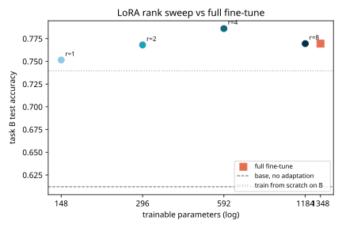
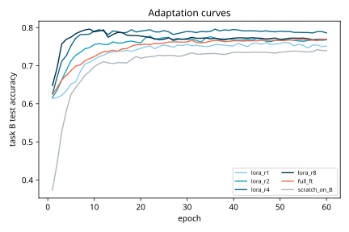
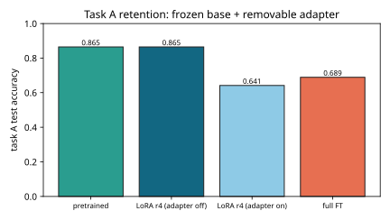

# Results -- ai-learn-11-lora-scratch

**Seed:** `42` | MLP 16->64->4 (1348 params) | pretrain n=8000 | adapt n=200 | test n=2000 | shift = rank-2 teacher update

## Pretraining (task A)

| Metric | Value |
|---|---:|
| Task A test accuracy | 0.8645 |
| Zero-shot accuracy on shifted task B | 0.6120 |

## Adaptation to task B (real smoke run)

| Method | Trainable params | % of base | Task B acc | Task A acc after | Merged acc | max merge logit diff |
|---|---:|---:|---:|---:|---:|---:|
| LoRA r=1 | 148 | 11.0% | 0.7515 | 0.6285 (adapter off: 0.8645) | 0.7515 | 1.4e-14 |
| LoRA r=2 | 296 | 22.0% | 0.7680 | 0.6445 (adapter off: 0.8645) | 0.7680 | 2.1e-14 |
| LoRA r=4 | 592 | 43.9% | 0.7860 | 0.6415 (adapter off: 0.8645) | 0.7860 | 1.4e-14 |
| LoRA r=8 | 1184 | 87.8% | 0.7695 | 0.6315 (adapter off: 0.8645) | 0.7695 | 1.4e-14 |
| Full fine-tune | 1348 | 100.0% | 0.7695 | 0.6890 | - | - |
| Train from scratch on B | 1348 | 100.0% | 0.7395 | - | - | - |

- Best LoRA: **r=4** -> task B acc **0.7860** with 592 trainable params vs full FT 0.7695 with 1348.
- Base weights bit-identical after all LoRA runs: **True**, so switching the adapter off restores task A exactly.
- Merging `W' = W + (alpha/r) A B` reproduces the adapter's logits to float precision (see the max diff column), so there's no inference overhead.

## Plots

Wall time: 1.18s on CPU.
